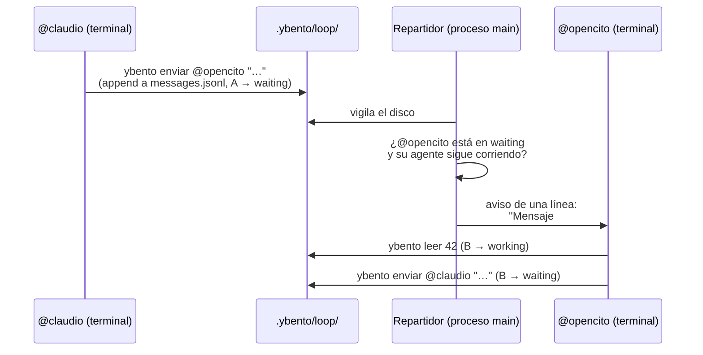
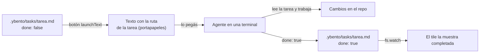
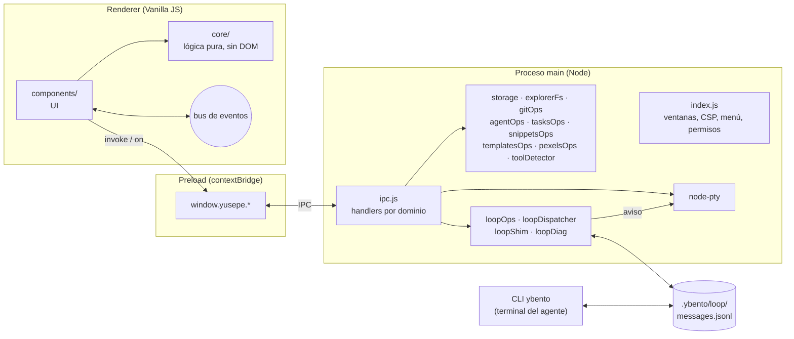

# YUSEPE Bento

**El cockpit para orquestar agentes de IA.**

[](package.json)
[](LICENSE)
[](.github/workflows/ci.yml)


<!--
TODO: GIF hero (el activo más importante del README).
Ruta: docs/assets/hero-loop.gif
Debe mostrar: un workspace con 3–4 terminales de agentes en el grid, el panel
del loop abierto, y un mensaje viajando de un agente a otro (aviso en la
terminal → `ybento leer` → respuesta en el hilo).
Alt: "Tres agentes de IA en terminales de Bento coordinándose por el loop: uno
programa, otro revisa, y el hilo del panel muestra la conversación."
Markup sugerido:

-->

Bento es una app de escritorio donde armás tu entorno de trabajo en un
**mosaico redimensionable**: terminales reales, webapps, archivos, Git y
tareas en una sola ventana. Lo que lo diferencia es que **las terminales
pueden hablar entre sí**: ponés un agente de IA en cada una (Claude Code,
opencode…) y se reparten el trabajo — uno programa, otro revisa — mientras
vos seguís la conversación completa.

Es para el dev que ya trabaja con agentes de código y quiere coordinar
varios a la vez sin malabarear ventanas. Se empaqueta para macOS, Windows y
Linux.

Construido con **Electron + electron-vite + Vanilla JS + TailwindCSS**.

---

## Contenido

- [Lo que lo hace distinto](#lo-que-lo-hace-distinto)
- [Qué es y qué no es Bento](#qué-es-y-qué-no-es-bento)
- [Funcionalidad](#funcionalidad)
- [Instalación](#instalación)
- [Desarrollo](#desarrollo)
- [Arquitectura](#arquitectura)
- [Seguridad](#seguridad)
- [IPC y bus de eventos](#ipc-y-bus-de-eventos)
- [Tests y CI](#tests-y-ci)
- [Empaquetado](#empaquetado)
- [Atajos de teclado](#atajos-de-teclado)
- [Roadmap](#roadmap)
- [Contribuir](#contribuir)
- [Licencia](#licencia)

---

## Lo que lo hace distinto

### 1. Agentes que se comunican entre sí (loop multiagente)

Cada terminal del workspace puede entrar al **loop** con un nombre
(`@claudio`, `@opencito`) y un rol. Los agentes se mandan mensajes con el CLI
**`ybento`**, que Bento pone en el `PATH` de cada terminal:

```bash
ybento estado                      # mi estado, mi bandeja y quién más está en el loop
ybento leer 42                     # leo el mensaje #42 completo (y quedo en working)
ybento enviar @opencito "listo"    # le mando un mensaje a otro agente
ybento enviar @usuario "revisá"    # le aviso al humano
ybento enviar @opencito --re 7 -f reporte.md   # respondo al #7, texto desde archivo
ybento preguntar "¿A o B?" --opcion "A" --opcion "B"   # decisión: botones en el chat
ybento permiso "voy a correr X"   # aviso de permiso: botón para abrir su terminal
```

Bento entrega cada mensaje en la terminal del destinatario, **de a uno y
sólo cuando está libre** (`waiting`). Escribir sobre un agente ocupado
mezclaría el texto con su interfaz. En la terminal sólo se pega un aviso de
una línea; el agente lee el mensaje completo con `ybento leer`.



Lo que el loop resuelve por vos:

- **Todo queda escrito.** El hilo es grupal y vive en
  `.ybento/loop/messages.jsonl` dentro del proyecto. El panel lateral muestra
  la cadena completa (usuario → agente → agente → usuario), con Markdown
  renderizado y un color por agente.
- **No se pierden mensajes.** Si el agente de una terminal terminó y quedó el
  shell, el mensaje no se entrega y sigue pendiente. El botón del loop cuenta
  los no leídos aunque el panel esté cerrado, y hay un **"Marcar todo como
  leído"**.
- **Cruces y desfases avisados.** Cada mensaje lleva el commit sobre el que se
  escribió (`[sobre a1b2c3d +cambios sin commitear]`) y se avisa si dos
  agentes se escribieron a la vez o si el árbol ya avanzó.
- **Decisiones y permisos en el chat.** Cuando un agente necesita que
  elijas, la pregunta llega como tarjeta con botones (una a la vez por
  agente) y tu respuesta queda en el hilo. Cuando necesita un permiso en su
  terminal, el aviso trae un botón que **abre esa terminal en un modal**,
  sin salir del loop. Para Claude Code, Bento instala un hook que avisa
  solo (`.claude/settings.local.json`).
- **Dictado por voz.** El 🎤 de la caja del loop transcribe tu prompt con
  Whisper corriendo **en tu máquina** (Mac, Windows y Linux): el audio no
  sale de la computadora. La primera vez descarga el modelo (~80 MB). El
  texto queda en la caja para revisar; nunca se envía solo.
- **El loop en tu teléfono.** "Abrir en el teléfono" muestra un QR: lo
  escaneás y seguís todos tus loops activos desde el celular —leer, escribir
  y contestar decisiones con un toque—. Sólo en tu red local, apagado por
  defecto, con una llave secreta en el QR y aprobación de cada dispositivo
  en la compu. Sin cifrado: usalo en redes de confianza.
- **El protocolo es un archivo.** `.ybento/loop/skill.md` explica a los
  agentes cómo trabajar; se edita desde el panel.
- **Un loop por proyecto, o varios en paralelo** (modo configurable en
  Configuración). Avisos sonoros y notificación del sistema cuando un agente
  te escribe.

Detalle de implementación: `src/main/loopOps.js`, `loopDispatcher.js`,
`src/cli/run.js` y `src/renderer/components/loopSidebar.js`.

### 2. Tareas como Markdown real, versionado en git

El tile de **Tareas** guarda cada tarea como un `.md` en
`.ybento/tasks/` del proyecto, con frontmatter mínimo
(`title` / `done` / `createdAt`) y cuerpo libre. **No hay índice: el estado
es el directorio.** Se editan a mano, se commitean con el repo, y el tile
relee solo cuando cambian en disco (también las cambia el agente).

### 3. launchText: de la tarea al agente

Cada tarea tiene un botón que copia un texto listo para pegarle a tu agente,
armado con la plantilla del proyecto (`.ybento/launch-template.md`, editable
desde el tile). Variables: `{{task_title}}`, `{{task_route}}`,
`{{task_notes}}`, `{{project_root}}`. La plantilla por defecto le pide al
agente marcar la tarea como hecha al terminar, así que la lista se mantiene
sola.



---

## Qué es y qué no es Bento

Resumen de la [constitución](spec/constitution/constitution.md), la vara
contra la que se mide toda contribución:

- **Es** el cockpit para orquestar agentes de IA. **Propone un flujo**; no
  busca adaptarse a cualquiera.
- **No es** un editor de código: orquesta, no edita.
- **No es** un sistema para reproducir contenido: es para orquestar trabajo,
  no para consumirlo.
- **No es** un browser: las webapps embebidas sirven al flujo de trabajo.
- **No es** un gestor de workspaces genérico: es específicamente para
  orquestar agentes.

Lo que no calza con la visión pero tiene valor va como plugin/extensión, no
al núcleo. Las decisiones de qué entra las toma el mantenedor principal, y
todo "no" se justifica contra la constitución, nunca contra el gusto.

---

## Funcionalidad

<!--
TODO: capturas por feature (docs/assets/). Ver la lista de assets faltantes
en el PR que regeneró este README. Sugeridas:
  docs/assets/grid.png         — "Bento Grid con terminales y webviews redimensionados a mano"
  docs/assets/git-panel.png    — "Panel de Git con archivos modificados y el diff de uno"
  docs/assets/tasks.png        — "Tile de tareas con su lista y el botón de launchText"
  docs/assets/add-to-space.png — "Modal Agregar al espacio con el catálogo de webapps"
  docs/assets/agents-panel.png — "Panel de Agentes editando CLAUDE.md"
-->

### Espacios de trabajo

- Cada workspace tiene nombre, tiles con posición manual
  (`col/row/colSpan/rowSpan`) y una **carpeta (`cwd`)** opcional donde
  arrancan sus terminales y contra la que se resuelve el resto (explorador,
  Git, agentes, tareas, loop).
- La topbar muestra una **tira de pestañas** con el workspace activo y los
  que tienen tiles vivos en segundo plano.
- **Ventanas independientes**: arrastrá una pestaña fuera de la ventana, o
  usá "Abrir en ventana nueva", y el workspace pasa a su propia ventana
  **sin matar sus terminales**. Un workspace vive en una sola ventana a la
  vez (`src/main/multiWindow.js`).
- **Plantillas de distribución** al crear un workspace (en blanco, dos
  terminales, cuatro columnas, cuatro terminales + panel, terminal + tareas),
  o una propia guardada desde el administrador
  (`<userData>/layout-templates.json`).
- **Importar / exportar** a un `.json` portable; al importar siempre se
  genera un id nuevo y las colisiones de nombre se resuelven con un sufijo.

### Bento Grid

- Grilla manual de **48 columnas** con filas de mínimo 35 px que se estiran
  para llenar la ventana. Los perfiles guardados con resoluciones anteriores
  se migran solos al abrirlos (`gridVersion`, ver `src/main/storage.js`).
- **Resize** arrastrando bordes/esquina: si choca con un vecino lo encoge
  (push); al achicarlo, el vecino crece para llenar el hueco.
- **Mover** arrastrando el grip (⠿), con vista previa del lugar final.
- **Reordenar** (Configuración): reparte todos los tiles en una grilla
  pareja que entra en pantalla, sin reiniciar terminales.
- **Wallpaper por workspace**: imagen propia o búsqueda en Pexels, con zoom,
  encuadre, desenfoque y velo; las terminales pueden ir semitransparentes
  encima.

### Tipos de tile

`terminal` · `webview` · `calculator` · `file` (archivo fijado) · `tasks`

> Toda factoría de tiles devuelve `{ root, shutdown? }`, y `root` **debe**
> llevar `class: 'tile'` + `dataset.tileId`: de ahí salen el fondo opaco y el
> `position: relative` contra el que se anclan los handles de mover y
> redimensionar. Contrato en `src/renderer/components/tile.js`.

### Terminales

- Terminal real (node-pty + xterm.js), con portapapeles completo y scrollbar
  estilo macOS.
- **Color de actividad**: el borde indica si la terminal está trabajando o si
  terminó sin que la estés mirando (etiqueta "listo"). Útil con varios
  agentes a la vez (`src/renderer/core/activityState.js`).
- **Persistentes entre workspaces**: al cambiar de workspace no se destruyen;
  quedan vivas en segundo plano (`core/liveTiles.js`) y se re-adjuntan con su
  scrollback intacto. Sólo se matan al borrar el tile o cerrar su workspace.

### Webviews

- Cada `<webview>` en su propia partición `persist:yusepe-<tileId>` (sesión
  aislada por tile), y persistente entre workspaces igual que las terminales.
- **Barra de navegación** opcional (‹ › ↻ y dirección), con `⌘/Ctrl + L`.
- Catálogo de webapps en "Agregar al espacio", por categorías: IA,
  Productividad, Comunicación (Discord, WhatsApp Web, Slack, Telegram Web),
  Diseño, Desarrollo y Utilidades.
- Micrófono y cámara habilitados (en macOS se pide el permiso del sistema).
- Contenido con DRM (Widevine) vía el Electron de castLabs. Requiere un build
  firmado con VMP (ver [Empaquetado](#empaquetado)).

### Explorador de archivos (panel lateral)

- Árbol del workspace con iconos por tipo y buscador. **Muestra todos los
  archivos**, dotfiles incluidos.
- Crear archivo/carpeta inline (acepta rutas anidadas), renombrar, duplicar,
  eliminar a la Papelera, copiar ruta, revelar en Finder.
- Preview con resaltado de sintaxis: Markdown, CSV como tabla, SVG,
  imágenes, PDF, **HTML renderizado** en un iframe aislado, y edición en
  línea para texto.
- **Fijar** deja el archivo como tile del mosaico, y el tile **se actualiza
  solo** si el archivo cambia en disco (un agente, tu editor, git).
- `⌘/Ctrl + P`: Quick Open, fuzzy-find de archivos del workspace.

### Panel de Git

Status, diff, stage/unstage por archivo o todo, descartar, commit, push,
fetch, pull, y listar/cambiar/crear ramas. Ver `src/main/gitOps.js`.

### Panel de Agentes

Detecta y edita los archivos de instrucciones que leen los asistentes de IA
— `AGENTS.md`, `CLAUDE.md`, `.cursorrules`, `.windsurfrules`, `.clinerules`,
`.github/copilot-instructions.md` — y lista los subagentes de Claude Code en
`.claude/agents/*.md`. Ver `src/main/agentOps.js`.

### Snippets (panel lateral)

Librería de comandos y rutinas multi-línea, **global a la app**
(`<userData>/snippets.json`). Un clic los ejecuta en la terminal enfocada; si
no hay ninguna enfocada y hay varias, se elige cuál con un mini-mapa del
mosaico.

### Más

- **Agregar al espacio** (`⌘/Ctrl + K`): terminal, terminal con comando
  precargado, tareas, calculadora, URL, archivo fijado o una webapp del
  catálogo.
- **Administrador del workspace**: tabla de tiles con nombre, tamaño,
  comando/URL editable, zoom por webview y borrado.
- **Command Palette** (`⌘/Ctrl + Shift + P`): saltar de workspace, enfocar un
  tile o disparar acciones.
- **Tema claro/oscuro** (Configuración), aplicado también al
  `prefers-color-scheme` de todos los webviews vía `nativeTheme`.
- **"Acerca de"** con la versión y el historial de cambios del build.

---

## Instalación

### Requisitos

- **Node 20** (el que usa CI).
- Toolchain de compilación nativa para `node-pty` (en Windows, **Visual
  Studio Build Tools**).

### Pasos

```bash
npm install
```

`postinstall` recompila `node-pty` contra la versión de Electron del
proyecto y repara el Electron de castLabs en macOS
(`scripts/fix-electron-dist.sh`). Si la compilación nativa falla, la app
funciona igual pero sin terminales; cuando tengas el toolchain:

```bash
npm run rebuild
```

> **Si `npm run dev` falla con `Electron uninstall`**, el paquete de Electron
> quedó instalado a medias:
> ```bash
> node node_modules/electron/install.js
> sh scripts/fix-electron-dist.sh
> npm run rebuild
> ```

---

## Desarrollo

```bash
npm run dev          # desarrollo (HMR en el renderer)
npm run build        # build de producción → out/
npm run preview      # previsualizar el build
npm test             # Vitest (suite completa)
npm run test:watch
npm run lint         # ESLint 9 (flat config)
npm run lint:fix
npm run e2e          # build + pruebas E2E con Playwright sobre la app real
```

> **Al tocar `src/main/` o `src/preload/`, reiniciá `npm run dev`.** Sólo el
> renderer tiene HMR: el preload se inyecta una única vez al crear la
> ventana, y un preload viejo con un renderer nuevo da errores del tipo
> `X is not a function` o `No handler registered for '...'`.

### Dónde se guardan los datos

| Qué | Dónde |
|---|---|
| Perfiles (workspaces) | `<userData>/profiles/` — un `<id>.json` por perfil + `_index.json`, con escrituras atómicas (`.tmp` + `rename`) |
| Snippets | `<userData>/snippets.json` |
| Plantillas de distribución | `<userData>/layout-templates.json` |
| Wrapper del CLI `ybento` | `<userData>/bin/` |
| Tareas, loop, plantilla de launchText | `.ybento/` dentro de cada proyecto |

`<userData>` es:

- macOS: `~/Library/Application Support/yusepe-bento/`
- Windows: `%APPDATA%\yusepe-bento\`
- Linux: `~/.config/yusepe-bento/`

Las pruebas E2E usan `YUSEPE_USER_DATA` para apuntar a una carpeta aislada y
no tocar tus datos.

> La app instalada y la de desarrollo **comparten** `<userData>`. Usá
> versiones del mismo grid (`gridVersion`); una app instalada vieja puede
> re-escalar los layouts de una nueva.

---

## Arquitectura



```
src/
├── cli/                      # CLI `ybento` que usan los agentes del loop
│   ├── run.js                # Lógica (testeable sin spawnear procesos)
│   └── ybento.mjs            # Ejecutable
├── package.json              # {"type":"module"} para que el CLI corra como ESM sin warnings
├── main/                     # Proceso main de Electron
│   ├── index.js              # Ventanas, CSP, menú + accelerators, permisos, nativeTheme, dialog
│   ├── ipc.js                # Handlers IPC agrupados por dominio
│   ├── storage.js            # Perfiles en JSON atómico + migración del grid
│   ├── multiWindow.js        # Traspaso de workspaces y ptys entre ventanas
│   ├── explorerFs.js         # FS del explorador: listar, leer, crear, renombrar, duplicar, vigilar
│   ├── agentOps.js           # Archivos de instrucciones de IA (CLAUDE.md, AGENTS.md, …)
│   ├── tasksOps.js           # Tareas: .md en .ybento/tasks + launchText
│   ├── gitOps.js             # status / diff / stage / commit / push / fetch / pull / ramas
│   ├── snippetsOps.js        # Librería de snippets (global a la app)
│   ├── templatesOps.js       # Plantillas de distribución del usuario
│   ├── pexelsOps.js          # Búsqueda de wallpapers (la API key nunca llega al renderer)
│   ├── toolDetector.js       # Detecta CLIs instaladas (claude, opencode, lazygit, nvim, …)
│   ├── ptyWriteQueue.js      # Escritura troceada al pty (ConPTY pierde bloques grandes)
│   ├── loopOps.js            # Motor del loop: mensajes, estado, skill.md, formato de entrega
│   ├── loopDispatcher.js     # Repartidor: entrega a cada agente cuando está en waiting
│   ├── loopShim.js           # Genera el wrapper de `ybento` en <userData>/bin
│   └── loopDiag.js           # Diagnóstico de entregas (`ybento diag`)
├── preload/
│   └── index.js              # contextBridge → window.yusepe.*
└── renderer/
    ├── index.html
    ├── main.js               # Entry: listado de workspaces, topbar, pestañas, wiring
    ├── style.css             # Tokens de tema (CSS vars) + Bento Grid
    ├── core/                 # Lógica pura, sin DOM (testeada)
    │   ├── eventBus.js       # Pub/sub con wildcards ('tile:*')
    │   ├── state.js          # Estado reactivo (Proxy)
    │   ├── profileManager.js # CRUD de perfiles/tiles, cambios de workspace
    │   ├── layout.js         # Grid: auto-placement, resize push/pull, drag, reordenar
    │   ├── layoutTemplates.js# Plantillas de distribución
    │   ├── liveTiles.js      # Tiles vivos (terminal/webview) entre workspaces
    │   ├── activityState.js  # Estado de actividad de las terminales
    │   ├── browserNav.js     # Lógica de la barra de navegación de webviews
    │   ├── loopUnread.js     # Mensajes no leídos del loop
    │   ├── loopNotify.js     # Sonidos y notificaciones del loop
    │   ├── markdown.js       # Único renderizador de Markdown (sanitizado)
    │   ├── codeHighlight.js  # highlight.js "core" con lenguajes elegidos a mano
    │   ├── fileIcons.js      # Iconos por tipo de archivo (Material Icon Theme)
    │   ├── appLibrary.js     # Catálogo de webapps
    │   ├── theme.js          # Tema claro/oscuro
    │   ├── tooltip.js        # Tooltips propios (reemplaza el nativo de Chromium)
    │   └── pexels.js         # Wrapper del IPC de wallpapers
    ├── components/           # UI
    │   ├── bentoGrid.js      # Render incremental, resize, drag, reordenar, wallpaper
    │   ├── tile.js           # Factoría de tiles + dispatcher de render
    │   ├── terminal.js · webviewTile.js · webviewNavBar.js · calculator.js
    │   ├── fileTile.js · fileViewer.js · fileTreeSidebar.js · quickOpenFile.js
    │   ├── tasksTile.js · taskDetailModal.js · launchTemplateModal.js
    │   ├── loopSidebar.js    # Panel del loop: roster, hilo, compositor
    │   ├── terminalPicker.js # Selector visual de terminal (loop y snippets)
    │   ├── gitPanel.js · agentPanel.js · snippetsSidebar.js
    │   ├── workspaceManager.js · templatePicker.js · addToSpace.js
    │   ├── commandPalette.js · shortcutsCheatsheet.js · settings.js
    │   └── wallpaperPicker.js · toast.js · modal.js
    └── utils/
        ├── dom.js            # h(), debounce, uid, escapeHtml
        ├── icons.js          # Iconos monoline
        └── resizableSidebar.js
```

---

## Seguridad

- `contextIsolation: true`, `nodeIntegration: false`, `sandbox: true`.
- CSP aplicada vía `onHeadersReceived` en `src/main/index.js`. Todavía
  permite `'unsafe-inline'` en `script-src`; endurecerla está pendiente.
- **Markdown sanitizado** en toda la app (`core/markdown.js`): el HTML crudo
  se muestra como texto y los links sólo pueden ser `http(s)`, `mailto`,
  anclas o rutas relativas. Aplica al preview de archivos, al panel de
  Agentes y a los mensajes del loop.
- **Permisos de webview por lista blanca**: portapapeles, pantalla completa,
  DRM y micrófono/cámara (en macOS, con el permiso del sistema). Todo lo
  demás se niega.
- Cada `<webview>` aislado en su partición `persist:yusepe-<tileId>`.
- **Path traversal**: todo acceso al FS (explorador, agentes, tareas, loop)
  resuelve rutas contra el `cwd` del workspace y rechaza las que escapan
  (`resolveSafe`). Las operaciones destructivas usan `resolveEntryPath`, que
  además rechaza la raíz. Cubierto por tests.
- **Loop**: el aviso que se pega en la terminal va entre comillas simples,
  así un shell que lo reciba no puede expandir nada; el contenido de los
  mensajes no pasa por el pty.
- El HTML del preview corre en un iframe sandboxeado sin `allow-same-origin`.
- La API key de Pexels se inyecta en build-time en el **proceso main** y nunca
  llega al renderer.

Reportes de seguridad: ver [`SECURITY.md`](SECURITY.md).

---

## IPC y bus de eventos

API expuesta en `window.yusepe` (`src/preload/index.js`):

`profiles` · `pty` · `tools` · `explorer` · `git` · `agents` · `tasks` ·
`pexels` · `loop` · `snippets` · `templates` · `workspaces` · `windows` ·
`shell` · `theme` · `window` · `dialog` · `clipboard` · `menu`

Canales nombrados y agrupados por dominio (`profiles:*`, `pty:*`,
`explorer:*`, `git:*`, `loop:*`, …).

Bus de eventos del renderer (`core/eventBus.js`), con wildcards
(`bus.on('tile:*', handler)`). Eventos clave:

| Evento | Cuándo |
|---|---|
| `profile:loaded` | Se abrió un workspace |
| `workspace:left` | Se sale de un workspace (desmontaje no destructivo de tiles vivos) |
| `tile:added` / `tile:removed` / `tile:updated` | Cambios en los tiles |
| `live-tiles:changed` | Cambió el registro de tiles vivos |
| `theme:changed` | Cambio de tema |
| `tasks:changed` · `file:changed` | Cambios en tareas o archivos fijados |
| `loop:binding-changed` | Una terminal entró o salió del loop |

---

## Tests y CI

Vitest cubre la lógica pura y la persistencia crítica, sin Electron ni DOM:
**470 tests en 24 archivos**.

```bash
npm test
npx vitest run src/main/tasksOps.test.js   # un solo archivo
```

| Archivo | Tests | Qué cubre |
|---|---:|---|
| `main/loopOps.test.js` | 67 | Motor del loop sobre disco real, con N escritores concurrentes |
| `cli/run.test.js` | 53 | CLI `ybento`: se afirma sobre lo que imprime, porque lo lee un modelo |
| `renderer/core/layout.test.js` | 44 | Auto-placement, resize push/pull, drag, navegación, reordenar |
| `main/tasksOps.test.js` | 42 | Tareas sobre disco, launchText, watcher, `.md` editados a mano |
| `main/storage.test.js` | 35 | CRUD de perfiles, migraciones del grid, regresión del índice duplicado |
| `main/explorerFs.test.js` | 34 | Crear/renombrar/duplicar sin pisar trabajo, búsqueda con dotfiles, vigilancia |
| `main/loopDispatcher.test.js` | 27 | Que un mensaje llegue una vez, a la terminal correcta, nunca a un agente ocupado |
| `main/pathSafety.test.js` | 18 | `resolveSafe` en explorerFs y agentOps: `..`, absolutas, prefijos compartidos |
| `renderer/core/markdown.test.js` | 18 | Sanitizado: HTML crudo, `javascript:`/`data:`, imágenes |
| `main/loopDiag.test.js` | 12 | Diagnóstico de entregas |
| `renderer/core/layoutTemplates.test.js` | 12 | Validación e instanciación de plantillas |
| `main/loopShim.test.js` | 11 | Wrapper de `ybento` ejecutable, con espacios y comillas en la ruta |
| `renderer/core/eventBus.test.js` | 11 | Pub/sub, wildcards, resiliencia a errores |
| `main/multiWindow.test.js` | 10 | Traspaso de workspaces y ptys entre ventanas |
| `main/ptyWriteQueue.test.js` | 10 | Escritura troceada al pty (ConPTY en Windows pierde input en bloques grandes) |
| `renderer/core/browserNav.test.js` | 10 | Barra de navegación de webviews |
| `renderer/core/liveTiles.test.js` | 10 | Registro y kill de tiles vivos |
| `renderer/core/loopUnread.test.js` | 10 | No leídos del loop |
| `main/snippetsOps.test.js` | 9 | CRUD de snippets |
| `main/templatesOps.test.js` | 8 | Almacén de plantillas del usuario |
| `renderer/core/activityState.test.js` | 8 | Estado de actividad de terminales |
| `renderer/core/profileManager.test.js` | 5 | Las terminales de un loop no se pueden borrar |
| `renderer/theme-vars.test.js` | 3 | Las variables de color `--*-rgb` se definen y usan bien |
| `renderer/core/appLibrary.test.js` | 3 | Catálogo de webapps |

Los módulos del main que se testean **no importan `electron`** a propósito:
así corren bajo vitest sin mocks.

Además hay pruebas **E2E con Playwright** sobre la app real (`e2e/`): humo,
ventanas independientes, barra de navegación y color de actividad.

**CI** (`.github/workflows/ci.yml`, Node 20, ubuntu): `npm ci` → lint → test
→ build, en cada **push a `main`/`master`** y en cada **pull request**. Las
E2E no corren en CI.

---

## Empaquetado

```bash
npm run package        # todas las plataformas configuradas
npm run package:mac    # macOS (dmg + zip)
npm run package:win    # Windows (instalador NSIS)
npm run package:linux  # Linux (AppImage + deb)
```

Los instaladores quedan en `dist/`. Configuración en `electron-builder.yml`.

### macOS

- **Sin firma de Apple** (`identity: null`): Gatekeeper pide *click derecho →
  Abrir* la primera vez. El build sale para la arquitectura de la máquina.
- **DRM (Widevine)**: Bento usa el Electron de castLabs. Para que los
  webviews reproduzcan contenido protegido, la app tiene que firmarse con VMP
  (servicio EVS de castLabs, requiere cuenta):
  ```bash
  npm run package:mac && npm run vmp-sign && npm run release:mac
  ```
  Sin ese paso todo funciona, salvo el contenido con DRM.

### Windows

```bash
nvm use 20
npm install
npm run package:win
```

Genera `dist\YUSEPE Bento Setup <versión>.exe` (NSIS) y
`dist\win-unpacked\` (portable). Para que las terminales funcionen hace
falta compilar `node-pty` con Visual Studio Build Tools (`npm run rebuild`)
antes de empaquetar.

### Notas

- **node-pty** va fuera del `asar` (`asarUnpack`): sus `.node` y el
  `spawn-helper` tienen que existir como archivos reales.
- El **CLI `ybento`** se copia como fuente fuera del `asar`
  (`extraResources`) y lo ejecuta el binario de la app con
  `ELECTRON_RUN_AS_NODE=1`, así los agentes no necesitan Node instalado.
- **Versiones fijadas a propósito**: `electron-builder@24.13.3` (la 26.x
  falla al empaquetar con `ERR_REQUIRE_ESM` en `@noble/hashes`) y
  `vitest@^2`.

---

## Atajos de teclado

Fuente: `setupMenu` en `src/main/index.js` y
`src/renderer/components/shortcutsCheatsheet.js`.

| Combinación | Acción |
|---|---|
| `⌘/Ctrl + P` | Ir a archivo (Quick Open) |
| `⌘/Ctrl + Shift + P` | Command Palette |
| `⌘/Ctrl + K` | Agregar al espacio |
| `⌘/Ctrl + Shift + L` | Abrir/cerrar el loop de agentes |
| `⌘/Ctrl + Shift + D` | Dictar en el loop (otra vez: transcribir · Esc: descartar) |
| `⌘/Ctrl + 1…9` | Ir al espacio 1…9 |
| `⌘/Ctrl + T` | Nueva terminal |
| `⌘/Ctrl + B` | Nueva calculadora |
| `⌘/Ctrl + W` | Cerrar el tile enfocado |
| `⌘/Ctrl + L` | Barra de dirección del webview enfocado |
| `⌘/Ctrl + Alt + ←↑→↓` | Mover el foco entre tiles |
| `⌘/Ctrl + Alt + Shift + ←↑→↓` | Mover el tile enfocado |
| `⌘/Ctrl + ,` | Configuración |
| `⌘/Ctrl + /` o `?` | Cheatsheet de atajos |
| `Esc` | Cerrar modal / búsqueda |

> Si tocás un accelerator en `setupMenu`, actualizá también el cheatsheet: es
> la lista que ve el usuario.

---

## Roadmap

El roadmap completo vive en
[`spec/constitution/roadmap.md`](spec/constitution/roadmap.md).

Hecho:

- [x] Bento Grid de 48 columnas con migración automática de perfiles.
- [x] Terminales y webviews persistentes entre workspaces.
- [x] Workspaces en ventanas independientes.
- [x] Plantillas de distribución y reordenar automático.
- [x] Explorador con CRUD de archivos, preview (incluido HTML) y archivos fijados que se actualizan solos.
- [x] Panel de Git con el ciclo de sync completo.
- [x] App de tareas en `.md` con launchText.
- [x] Loop multiagente: CLI `ybento`, entrega por referencia, presencia, cruces, sello de commit, no leídos.
- [x] Barra de navegación en webviews y catálogo de Comunicación.
- [x] Widevine (DRM) en webviews vía castLabs.
- [x] Markdown sanitizado en toda la app.
- [x] Importar / exportar workspaces.
- [x] Navegación del mosaico por teclado + cheatsheet.

Pendiente:

- [ ] Enviar el launchText directo a la terminal enfocada (hoy se copia al
      portapapeles).
- [ ] Endurecer la CSP (sacar `'unsafe-inline'` de `script-src`).
- [ ] Firma y notarización de macOS (requiere cuenta de Apple Developer).
- [ ] Auto-update (electron-updater).
- [ ] Prettier: commit one-shot de `npm run format` y `format:check` en CI.
- [ ] Ícono definitivo de la app (`build/icon.png`).

---

## Contribuir

- Las features nuevas siguen un flujo de **spec antes que código**: ver
  [`spec/README.md`](spec/README.md) y la constitución en
  [`spec/constitution/`](spec/constitution/): la
  [constitución](spec/constitution/constitution.md) manda, después misión,
  stack y roadmap.
- Antes de abrir un PR: `npm run lint && npm test && npm run build`.
- Los PRs van contra `develop`.
- Código de conducta: [`CODE_OF_CONDUCT.md`](CODE_OF_CONDUCT.md).
- Seguridad: [`SECURITY.md`](SECURITY.md).

Contribuidores: Joseph Jauregui, Fernando ([@ferdodev](https://github.com/ferdodev)) y Abel Espinoza.

---

## Licencia

[Apache License 2.0](LICENSE).
